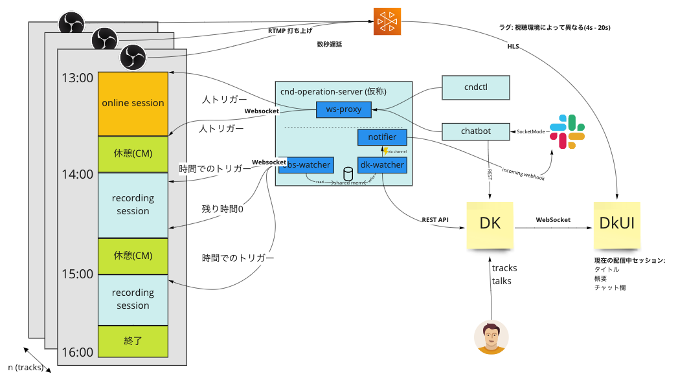

# cnd-operation-server



## 使い方

server を常駐させて利用する方法と cndctl 単体で動かす方法と 2 通り存在するため、そのそれぞれについて説明します。

コマンドの引数について詳しく知りたい場合は `<コマンド名> -h` で確認してください。

### server 常駐方式

上記の図における `cnd-operation-server` がここで言う server に当たります。

サーバは以下のコマンドで起動します。

```bash
# TODO (#2)
```

cndctl コマンドの引数に上記サーバのアドレスを与えることで、 server を経由して OBS Studio に対して任意の操作が可能です。

- 例

```
$ cndctl -d 127.0.0.1:20080 scene list --track-id 1
> [ 2] シーン 1
  [ 1] シーン 2
  [ 0] シーン 3
```

### cndctl 単体で利用する方法

cndctl コマンドの引数に `--directly` , `--obs-host` , `--obs-password` をそれぞれ指定することで、 cndctl から直接 OBS Websocket に対してリクエストすることも可能です。

なお、現在 wss (WebSocket over TLS) には対応していないためご注意ください。

- 例

```
$ cndctl --directly --obs-host 127.0.0.1:4455 --obs-password hogefuga scene list --track-id 1
> [ 2] シーン 1
  [ 1] シーン 2
  [ 0] シーン 3
```
